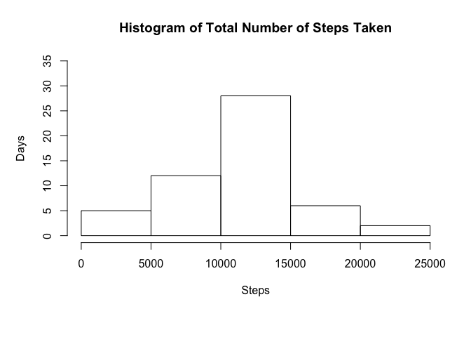
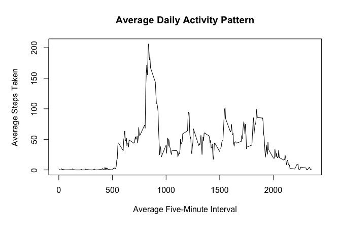
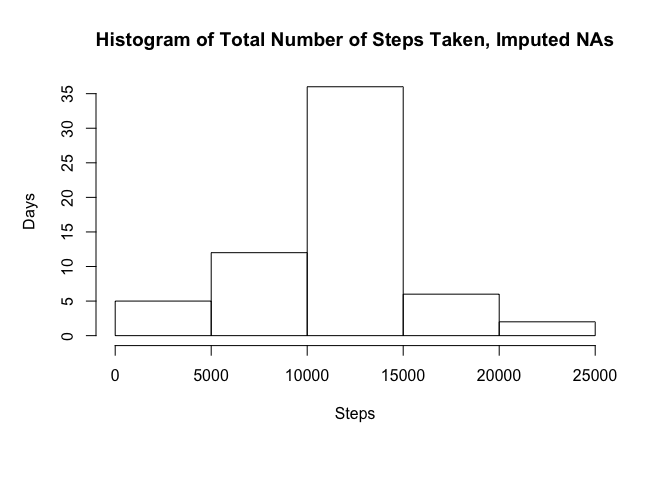
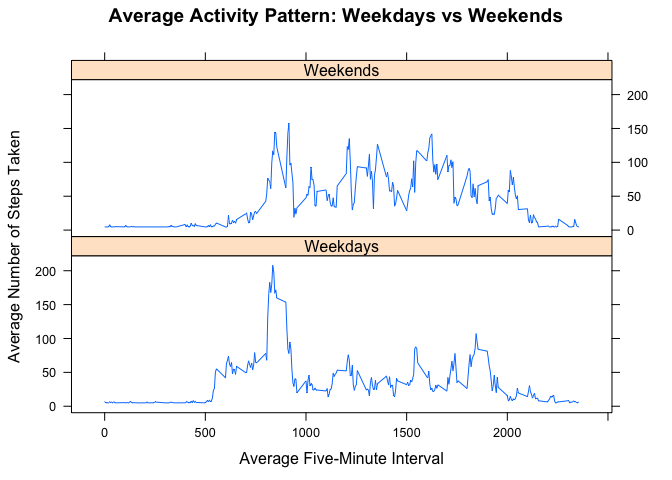

# Reproducible Research: Peer Assessment 1

## Prepare the R Environment
Since we want the report to be reproducible, we will set the knitr option echo = TRUE so that someone else will be able to read the code, and we'd want the results to "hold" for throughout the entire report.


```r
library(knitr)
```

```
## Warning: package 'knitr' was built under R version 3.1.2
```

```r
opts_chunk$set(echo = TRUE, results = 'hold')
```

## Loading and preprocessing the data

Assuming the data is already in the working directory. If not, it can be downloaded [here][1].

[1]: https://d396qusza40orc.cloudfront.net/repdata%2Fdata%2Factivity.zip


```r
setwd("~/Desktop/Coursera/Data/RepData_PeerAssessment1")
dat<-read.csv(unz("activity.zip", "activity.csv"))
```

## What is mean total number of steps taken per day?

1. calculate the total number of steps taken per day, omitting NAs


```r
d.steps <- aggregate(steps~date, data=dat, FUN= sum, na.action=na.omit)  
```

2. generate a histogram of the total number of steps taken per day


```r
par(mar = c(7, 5, 4, 2))
hist(d.steps$steps, main = paste ("Histogram of Total Number of Steps Taken"), xlab = "Steps", ylab = "Days", ylim=c(0, 35))
```

 

3. calculate the mean and median of the total number of steps taken per day


```r
mean(d.steps$steps)
median(d.steps$steps)
```

```
## [1] 10766.19
## [1] 10765
```

## What is the average daily activity pattern?

1. make a time series plot of the 5-minute interval and the average number of steps taken, average across all days


```r
dat$interval.f <- as.factor(as.character(dat$interval)) #convert interval to factor
mean.steps <- aggregate (steps~interval.f, data = dat, FUN="mean", na.action=na.omit) #average steps taken every 5-minute interval across all days, omitting NA???s
mean.steps$interval.f<-as.numeric(as.character(mean.steps$interval.f)) #convert interval back to numeric
mean.steps<-mean.steps[order(mean.steps$interval.f),] #sort interval by ascending 
# generate the histogram
par(mar = c(7, 5, 4, 2))
plot( mean.steps$interval.f, mean.steps$steps, type= "l", main = "Average Daily Activity Pattern", ylab = "Average Steps Taken", xlab = "Average Five-Minute Interval" )
```

 

2. find the maximum number of steps taken 


```r
mean.steps<-mean.steps[order(mean.steps$steps, decreasing=TRUE), ] #reorder the data in decreasing order, the first value would be the maximum
head(mean.steps)
```

```
##     interval.f    steps
## 272        835 206.1698
## 273        840 195.9245
## 275        850 183.3962
## 274        845 179.5660
## 271        830 177.3019
## 269        820 171.1509
```

## Imputing missing values

1. calculate and report the total number of NAs in steps 


```r
sum(is.na(dat$steps))
```

```
## [1] 2304
```

2. calculate the mean number of steps taken to use to fill in the NA values

```r
mean(mean.steps$steps)
```

```
## [1] 37.3826
```

3.  create a new dataset with NAs filled by rereading the data into a new data frame, and NAs filled with the value of 37.8 

```r
newdat <- data.frame(steps = dat$steps, date = dat$date, interval = dat$interval) # create a new dataset 
sum(is.na(newdat$steps)) # check the number of NAs that need to be replaced
newdat[is.na(newdat)] <- 37.38 # fill all NAs with the value 37.8
sum(is.na(newdat$steps)) # this step checks to make sure all the NAs a filled and no NA remained
```

```
## [1] 2304
## [1] 0
```


```r
newd.steps <- aggregate(steps~date, data=newdat, FUN= sum)
par(mar = c(7, 5, 4, 3))
hist(newd.steps$steps, main = paste ("Histogram of Total Number of Steps Taken, Imputed NAs"), xlab = "Steps", ylab = "Days")
```

 

## Are there differences in activity patterns between weekdays and weekends?

1. create a factor variable that identifies the dates between weekdays and weekend. 


```r
newdat$date<-as.Date(as.character(newdat$date)) # convert date field to as.Date so that R knows to handle it as date
newdat$weekends<- weekdays(newdat$date) == "Sunday" | weekdays(newdat$date) == "Saturday" # create a new variable that identifies the row data as weekends or not, weekends being Sunday and Saturday
mean <- aggregate(steps~interval + weekends, data=newdat, FUN="mean") # summarize the mean number of steps taken across the 5-minute intervals by weekends or not 
mean$weekends <- factor(mean$weekends, labels = c("Weekdays", "Weekends")) # factorize the weekends variable from logical to factor and label it weekdays or weekends
```

2. Second, compare the activitiy patterns by generating a panel chart to compare weekends versus weekdays


```r
library(lattice)
x <- xyplot(steps~interval| weekends, data = mean, layout = c(1, 2), type="l", main = "Average Activity Pattern: Weekdays vs Weekends", ylab = "Average Number of Steps Taken", xlab = "Average Five-Minute Interval" )
print(x)
```

 

